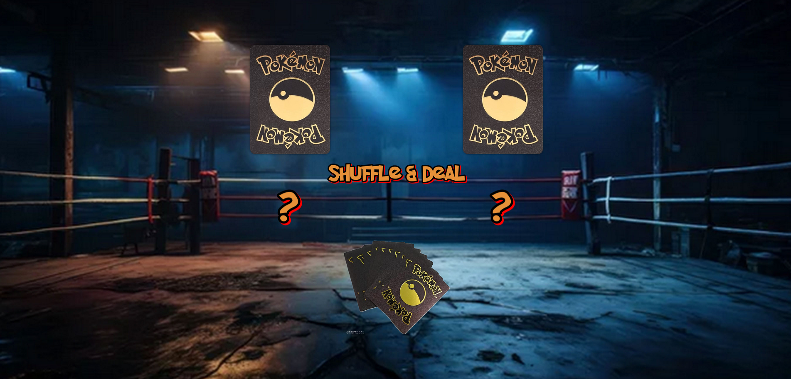
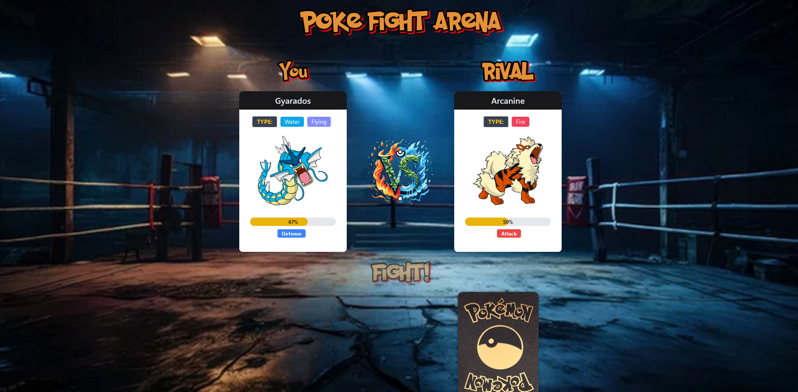
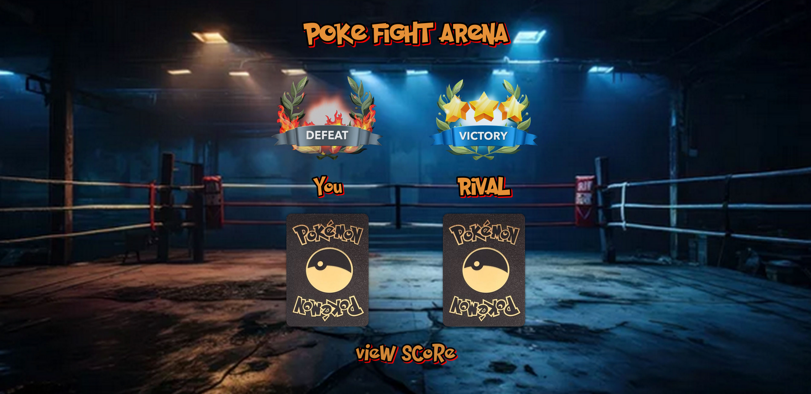
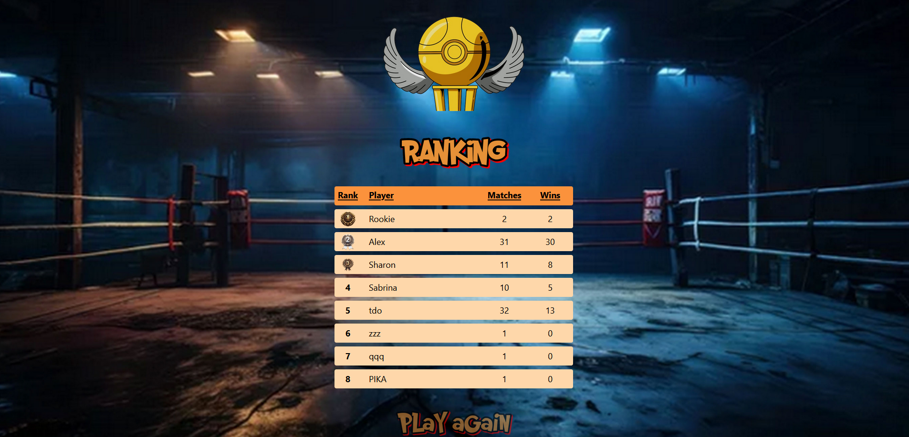

# PokéFight

Welcome to PokéFight, the ultimate Pokémon-themed card game! 🎮

## Team Members

### [tdolpz](https://github.com/tdolpz)

### [Aero1004](https://github.com/Aero1004)

### [SharonVko]

## Preview

### Play [Pokefight]()

## Overview

PokéFight is an exciting game where players battle using Pokémon cards. It’s built using React, Tailwind CSS, JavaScript, Next.js, MongoDB, and the Pokémon API. The game’s design is based on our custom Figma prototype.
Features

- User Registration: Enter your name on the start page, which is saved in a database for tracking player scores.

- Card Shuffling: Click the "Shuffle" button to randomly deal 5 Pokémon cards to both the player and the computer. Only the first card from each stack is revealed.

- Battle Mode: Click the "Fight" button to initiate a card battle. The player with the stronger card wins.

- Score Tracking: The winner’s score is saved in a score list, and the champion is crowned.

## Technology Stack

- MERN Stack: MongoDB, Express, React, and Node.js

- Next.js: For server-side rendering and static site generation

- Tailwind CSS: For styling the application

- JavaScript: For the game logic

- Pokémon API: For fetching Pokémon data

- Figma: For the design prototype

## Personal Touch

I’ve poured my heart into designing this game and matching the sounds to the gameplay, ensuring an immersive and enjoyable experience for all players. I hope you have as much fun playing as we all had creating it!

